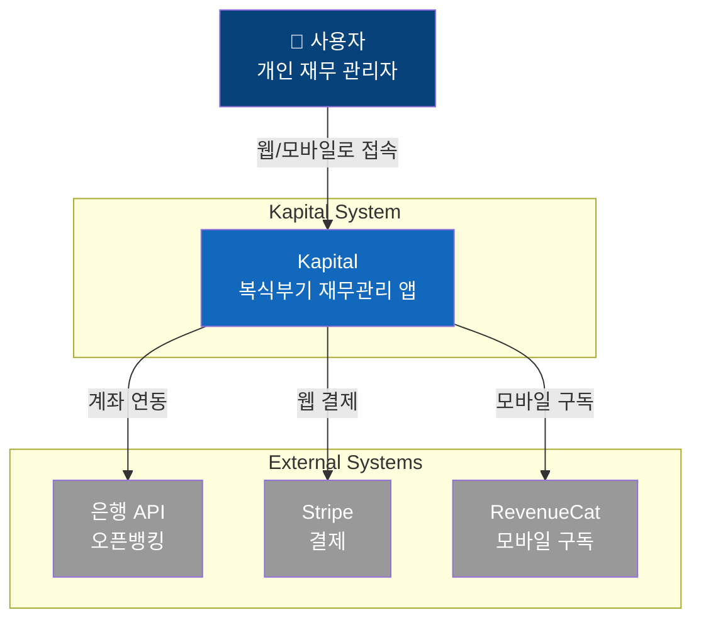
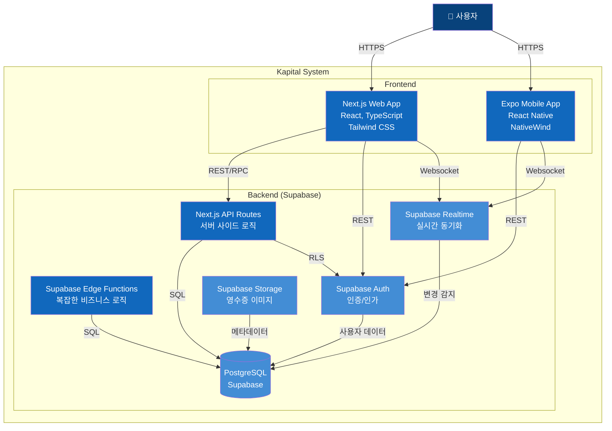
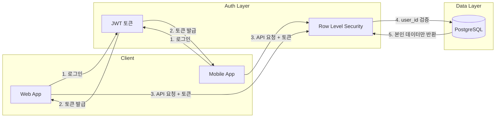

# Kapital 시스템 아키텍처 (C4 Container Diagram)

## Level 1: System Context



## Level 2: Container Diagram



## Level 3: Component Diagram (Web App)

```mermaid
graph TB
    subgraph "Next.js Web App"
        subgraph "App Router Pages"
            DASHBOARD[/dashboard<br/>대시보드]
            ACCOUNTS[/accounts<br/>계정 관리]
            TRANSACTIONS[/transactions<br/>거래 관리]
            REPORTS[/reports<br/>재무제표]
            SETTINGS[/settings<br/>설정]
        end

        subgraph "API Routes"
            API_ACCOUNTS[/api/accounts<br/>계정 CRUD]
            API_TRANSACTIONS[/api/transactions<br/>거래 CRUD]
            API_REPORTS[/api/reports<br/>재무제표 생성]
            API_EXPORT[/api/export<br/>데이터 내보내기]
        end

        subgraph "Shared Packages"
            PKG_DB[@kapital/db<br/>Supabase 클라이언트]
            PKG_UTILS[@kapital/utils<br/>유틸리티 함수]
            PKG_UI[@kapital/ui<br/>UI 컴포넌트]
        end
    end

    DASHBOARD --> API_ACCOUNTS
    DASHBOARD --> API_TRANSACTIONS
    ACCOUNTS --> API_ACCOUNTS
    TRANSACTIONS --> API_TRANSACTIONS
    REPORTS --> API_REPORTS

    API_ACCOUNTS --> PKG_DB
    API_TRANSACTIONS --> PKG_DB
    API_REPORTS --> PKG_DB

    PKG_DB --> SUPABASE[(Supabase)]

    style DASHBOARD fill:#85bbf0,color:#000
    style ACCOUNTS fill:#85bbf0,color:#000
    style TRANSACTIONS fill:#85bbf0,color:#000
    style REPORTS fill:#85bbf0,color:#000
    style SETTINGS fill:#85bbf0,color:#000
    style PKG_DB fill:#1168bd,color:#fff
    style PKG_UTILS fill:#1168bd,color:#fff
    style PKG_UI fill:#1168bd,color:#fff
```

## 컨테이너 설명

| 컨테이너           | 기술 스택                               | 역할                          |
| ------------------ | --------------------------------------- | ----------------------------- |
| **Web App**        | Next.js 14, React, TypeScript, Tailwind | 웹 사용자 인터페이스          |
| **Mobile App**     | Expo, React Native, NativeWind          | iOS/Android 앱                |
| **API Routes**     | Next.js API Routes                      | 서버 사이드 비즈니스 로직     |
| **Edge Functions** | Supabase Edge Functions, Deno           | 복잡한 계산, 외부 API 연동    |
| **Auth**           | Supabase Auth                           | OAuth, 이메일 인증, 세션 관리 |
| **Database**       | PostgreSQL (Supabase)                   | 모든 데이터 저장, RLS 적용    |
| **Storage**        | Supabase Storage                        | 영수증 이미지, 첨부파일       |
| **Realtime**       | Supabase Realtime                       | 멀티 디바이스 실시간 동기화   |

## 데이터 흐름

### 거래 입력 흐름

```
1. 사용자가 거래 입력 폼 작성
2. Web/Mobile → API Routes (POST /api/transactions)
3. API Routes → Supabase DB (journal_entries + transaction_lines INSERT)
4. RLS 정책이 user_id 자동 검증
5. Supabase Realtime → 다른 디바이스에 변경 전파
6. UI 자동 업데이트
```

### 재무제표 생성 흐름

```
1. 사용자가 재무제표 페이지 접근
2. Web → API Routes (GET /api/reports/balance-sheet)
3. API Routes → Supabase DB (계정별 잔액 집계 쿼리)
4. 계산된 재무제표 데이터 반환
5. 차트 컴포넌트로 시각화
```

## 보안 아키텍처



### RLS 정책 예시

```sql
-- 사용자는 자신의 계정만 조회 가능
CREATE POLICY "Users can view own accounts"
  ON accounts FOR SELECT
  USING (auth.uid() = user_id);

-- 사용자는 자신의 거래만 생성 가능
CREATE POLICY "Users can create own transactions"
  ON journal_entries FOR INSERT
  WITH CHECK (auth.uid() = user_id);
```

## 배포 아키텍처

```mermaid
graph TB
    subgraph "DNS"
        DNS[kapital.app]
    end

    subgraph "CDN / Hosting"
        VERCEL[Vercel<br/>Web App]
    end

    subgraph "Mobile Distribution"
        APPSTORE[App Store]
        PLAYSTORE[Play Store]
    end

    subgraph "Backend"
        SUPABASE[Supabase Cloud<br/>Auth + DB + Storage]
    end

    DNS --> VERCEL
    VERCEL --> SUPABASE
    APPSTORE --> SUPABASE
    PLAYSTORE --> SUPABASE
```

---

_이 문서는 Kapital의 기술 아키텍처를 설명합니다._
_Mermaid 다이어그램은 GitHub에서 자동 렌더링됩니다._
_최종 수정: 2025-12-16_
